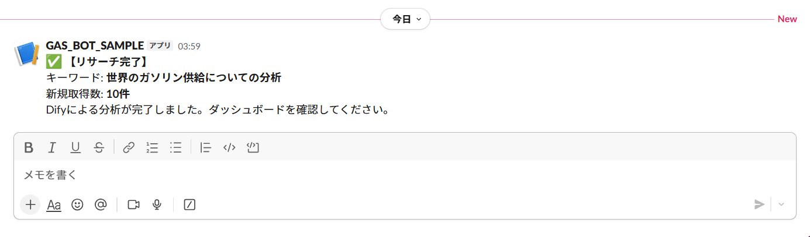
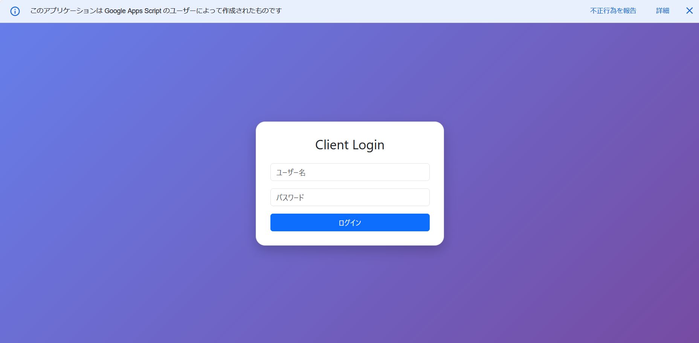
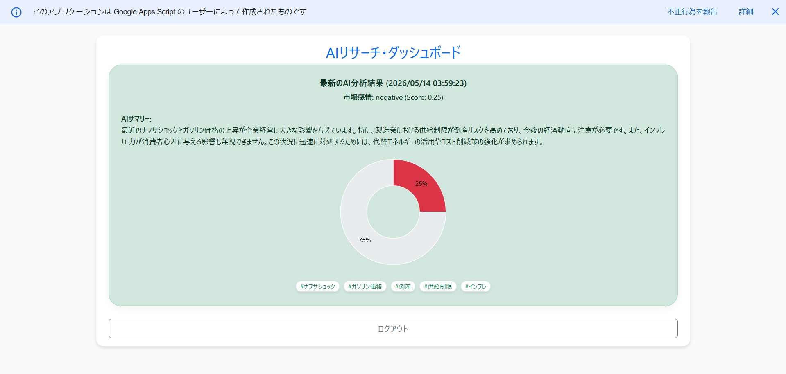
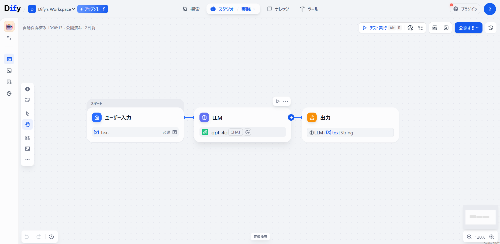
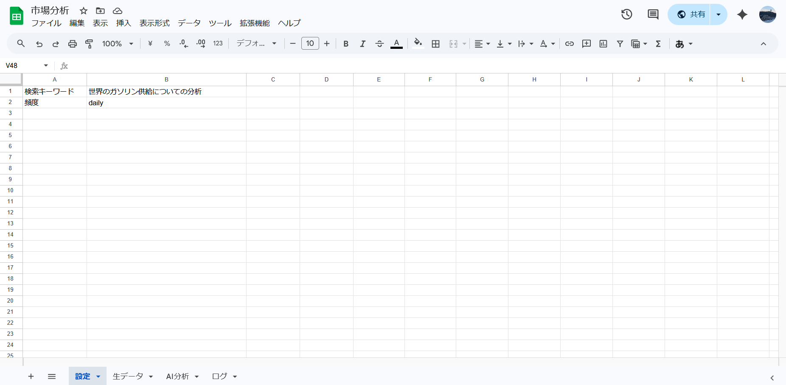
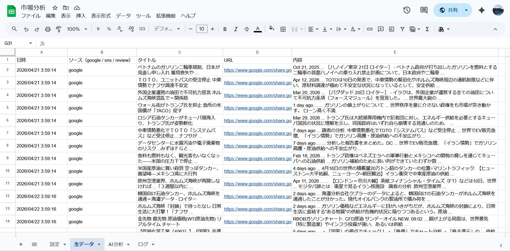
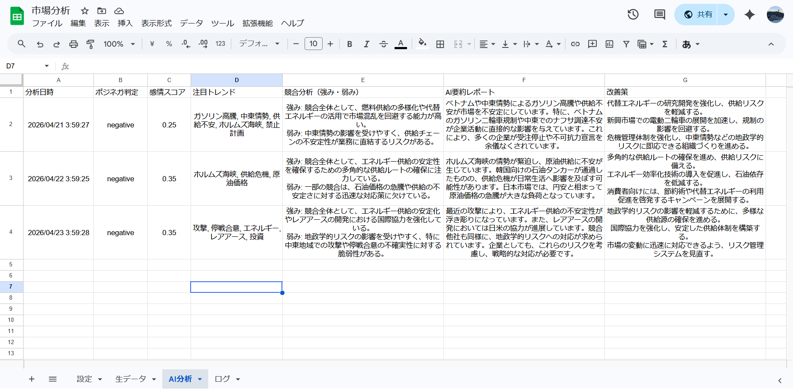

# Dify-App

## Dify-App: Auto Research & Analysis System
## Web情報収集・LLM分析・可視化を統合した自律型インテリジェンス・プラットフォーム

### 🔗 Live Demo (公開検証用)

#### https://script.google.com/macros/s/AKfycbwk7pm3Eb7vp0Hj29NweuC1AzqdjcZjCu01OnIs4nZ1gaUiOZexTrRyrVCyQ6G48SI/exec

### User ID: demo

### Password: demo

## 🛠 Current Status

#### https://docs.google.com/spreadsheets/d/1KqABS5Blonfm2scCW89rhnLx7ChabJR5iRGuiJ9tygA/edit?gid=1107744585#gid=1107744585

現在、本システム上で様々な検索ワードを設定し、動作検証と分析精度の確認をリアルタイムで進めています。実際の運用データに基づき、ロジックの微調整を継続的に行っている「生きたプロジェクト」です。

Google Apps Script (GAS) と Dify (LLM Workflow) を連携させ、特定トピックに関する最新情報の収集から、多角的なAI分析、そしてレポーティングまでを完全無人化した資産運用型リサーチシステムです。

ユーザーがキーワードを一度設定するだけで、

### ・深夜帯の自動Webリサーチ（StartIndexページング対応）

### ・URL重複排除によるコスト最適化

### ・Dify AIによるセンチメント・トレンド・競合分析

### ・Slack通知とWebダッシュボードによる可視化

これらがすべて自律的に実行されます。「意思決定」にリソースを集中させたいビジネスパーソンに最適です。

---

## 🚀 開発コンセプト：プロダクトへの「品格」と「堅牢性」

本システムは、単なる「動けばいいツール」を卒業し、「プロが商売で使えるシステム」を目指して設計されました。

v1.0（初版）でありながら、実運用で発生しがちな「データの欠損」「重複によるAPIコストの増大」「海外サーバー起因の時間のズレ」といった細かなノイズを徹底的に排除。
クライアントが放置していても、翌朝には常に「正確で、密度の高い、信頼できる分析レポート」が整列している状態を提供します。

---

## ✨ 主な機能と設計のこだわり

## 1. 検索深化ロジック（Deep Search Protocol）

Google Custom Search APIの仕様を超え、startIndexによる自動ページめくり機能を実装。目標とするデータ件数に達するまでリサーチを続行し、常にボリュームのある分析母数を確保します。

## 2. 朝一番の「意思決定」を支えるSlack通知

深夜帯に完了した分析結果を、毎朝3時〜4時の間にSlackへ自動送信します。

プッシュ型レポート: ダッシュボードを開く前に、スマホの通知で市場の動向を把握可能。

要約の即時性: 膨大な生データからAIが抽出した「経営者向けサマリー」をダイレクトに届けます。

朝のルーティンに溶け込む、洗練された通知レイアウト。

## 3. Webダッシュボード（Visual Intelligence）

index.html により、以下の機能を備えた専用UIを提供します。

### ・認証画面：ブランド感のあるグラデーションUIを採用

### ・感情分析の可視化: Google Charts を用いたドーナツチャートにより、市場のポジネガを直感的に把握

### ・ハッシュタグ・タグクラウド: AIが抽出した trend_words を動的に生成し、キーワードの熱量を視覚化

### ログイン画面

### ダッシュボード画面

AIによって構造化された最新の分析レポートを表示します。

### 📊 実行ログとデータの整合性について

StartIndexによるページング処理が正確に実行され、目標件数に達するまでリサーチを深化させている様子が確認できます。

#### 💡 日々リサーチを継続しているため、実行ログとダッシュボードの結果は常に最新の状態に更新されています。 常に「生きたデータ」を扱っているため、画像内の日付に差異がある場合がありますが、システムは正常に連携し稼働しています。

## 4. コストを最適化する「重複排除」

URLをピンポイントで照合し、同一記事を二度AIに投げない設計を徹底。APIコストを抑えつつ、分析の純度を高めています。

## 5. 信頼の「JST Timezone Lock」

全データを日本標準時（JST）で固定出力させ、ビジネス報告資料としての時間の整合性を維持します。

---

## 🧭 システムワークフロー

本システムは「深夜自動実行」＋「常時可視化」の2段構成で動作します。

## 🛠️ Dify 自律型分析ワークフロー

単なるAPI連携ではなく、Dify上で複数のノードを組み合わせた独自の分析パイプラインを構築しています。

情報収集から構造化データの生成までを司るAIワークフロー図

## 🧠 AIアナリスト・プロンプトの設計

ワークフローの核となるLLMノードには、企業のマーケティング分析に特化した高度な命令セット（プロンプト）を実装しています。

## 設計のこだわりポイント：

### 「生の声」の優先抽出: 規約や料金表などの無機質なデータではなく、ユーザーの体験や口コミといった「市場の反応」を最優先で分析。

### ノイズ自動除外: 検索エラーや認証画面などの不要な情報をAIが自動判別し、分析対象から除外。

### ビジネス・アウトプット: 経営層の意思決定を支援するため、JSON形式での構造化と、プロフェッショナルな日本語トーンを徹底。

---

## 🔁 使用するトリガーと役割

### 関数名  タイミング	 役割

#### main  毎日 3:00 - 4:00  リサーチ・排除・AI分析・Slack通知の全工程を完遂

#### getLatestAnalysis  常時 (Webアクセス時)  Webダッシュボードへ最新の分析結果を配信

---

## 🛠 技術仕様 (Tech Stack)

#### Backend: Google Apps Script (GAS)

#### AI Orchestration: Dify Workflow API

#### Frontend: HTML5 / CSS3 (Bootstrap 5.3) / Google Charts

#### Security: ScriptProperties API / シンプルな認証プロトコル

---

## 📂 ファイル構成とシート役割

### ファイル / シート名	役割

#### main.gs	リサーチ・分析・通知を司るコアロジック

### 設定	検索キーワードや実行頻度の管理

### 生データ	収集したWeb記事のバックアップ ＆ 重複チェック用DB

### AI分析	Difyが生成した構造化データの蓄積

### ログ	実行状況およびエラー履歴の管理

### index.html	モダンなUIを備えた、分析結果のWebダッシュボード

---

## 📈 今後の展望（Next Steps）

### 銘柄・キーワードの動的追加機能: ユーザーがダッシュボードから任意のキーワードを入力し、即座にリサーチを開始できるUIの構築。

### 長期的トレンド分析: 過去30日間のデータを遡及し、市場の変化を折れ線グラフで可視化する機能の拡張。

### グラフスケールの最適化: 急激なトレンド変化時にもグラフ表示が途切れないよう、自動スケール調整ロジックの導入。

---

## 🚀 セットアップ

### 本リポジトリの main.gs と index.html をGASエディタに配置。

### スクリプトプロパティに各種APIキーを設定。

### main 関数に時間主導型トリガー（深夜帯）を設定。

### 「デプロイ」>「ウェブアプリ」 として公開し、生成されたURLからダッシュボードにアクセス。

---

### ✨ インサイトを可視化する：専用 Web ダッシュボード

index.html は、AIによる高度な分析結果を、専門的な知識がなくても直感的に理解できるように設計された専用インターフェースです。

### 🌿 データの安全性を高めるアクセス設計

スプレッドシートを直接共有するのではなく、専用のログイン画面を介して情報を届ける仕組みを採用しました。
これにより、「うっかりデータを消してしまう」といった操作ミスを防ぎつつ、必要なメンバーやクライアントだけが安全に、かつスマートに最新のインサイトへアクセスできる環境を整えています。

## 🤝 どなたでも体験できる「デモ環境」の公開

このツールの機能性を、どなたでも公平かつスムーズに検証いただけるよう、あらかじめ「お試し用のログイン情報」を設定しています。
複雑なセットアップなしで、実際のレポートがどのように表示されるかをすぐにご体験いただけます。ぜひ、以下の情報でログインしてみてください。

### User ID: demo

### Password: demo

---

## ⚖️ ライセンス

### MIT License

"From Data to Information, from Information to Insight."

散らばった情報を整理し、AIを活用して次のアクションを見出す。
複雑なビジネス課題を解き明かす、一つのツールとしてお役立てください。
