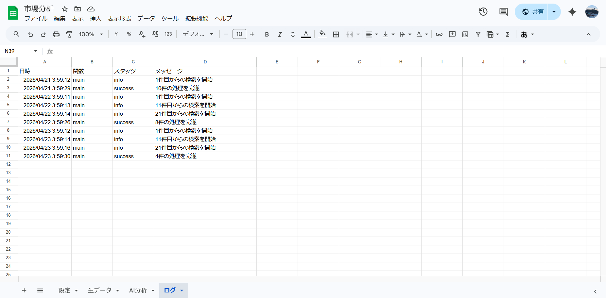

# Dify-App

Dify-App: Auto Research & Analysis System
Web情報収集・LLM分析・可視化を統合した自律型インテリジェンス・プラットフォーム

Google Apps Script (GAS) と Dify (LLM Workflow) を高度に連携させ、特定トピックに関する最新情報の収集から、多角的なAI分析、そしてレポーティングまでを完全無人化した資産運用型リサーチシステムです。

ユーザーがキーワードを一度設定するだけで、

    深夜帯の自動Webリサーチ（StartIndexページング対応）

    URL重複排除とクレンジングによるコスト最適化

    Dify AIによるセンチメント・トレンド・競合分析

    Slack通知とWebダッシュボードによるシームレスな可視化

これらがすべて自律的に実行されます。
「検索」という労働から人間を解放し、「意思決定」にリソースを集中させたいビジネスパーソンやリサーチャーに最適です。

## 🚀 開発コンセプト：プロダクトへの「品格」と「堅牢性」

本システムは、単なる「動けばいいツール」を卒業し、**「プロが商売で使えるシステム」**を目指して設計されました。

v1.0（初版）でありながら、実運用で発生しがちな「データの欠損」「重複によるAPIコストの増大」「海外サーバー起因の時間のズレ」といった細かなノイズを徹底的に排除。
クライアントが放置していても、翌朝には常に**「正確で、密度の高い、信頼できる分析レポート」**が整列している状態を提供します。

## ✨ 主な機能と設計のこだわり

1. 検索深化ロジック（Deep Search Protocol）

    仕様: Google Custom Search APIの仕様を超え、startIndexによるページめくり機能を実装。

    メリット: 検索1ページ目に「既読の重複」や「アクセス不可エラー」が含まれていても、新規データが10件貯まるまで自動で2ページ目、3ページ目へとリサーチを続行。常にボリュームのある分析母数を確保します。

2. インテリジェント・重複排除（Cost Optimization）

    仕様: URL列をピンポイントで照合し、trim()（空白削除）を徹底した厳格な重複排除。

    メリット: 同一記事を二度AIに投げることがなくなり、分析の鮮度向上とAPIトークン費用の最大効率化を両立しました。

3. 「JST Timezone Lock」による信頼性

    仕様: Utilities.formatDate により、全データを日本標準時（JST）で固定出力。

    メリット: Googleサーバーの所在地に依存せず、レポートの「作成日時」の整合性を完全に維持。ビジネス報告資料としての信頼性を担保します。

4. トレンドの動的可視化（Dynamic Tagging）

    仕様: AIが抽出した trend_words をダッシュボードへ受け渡す専用のデータパスを構築。

    メリット: 「#AI #自動化」といったハッシュタグ形式での可視化により、市場の熱量を直感的に把握することが可能になりました。

## 🧭 システムワークフロー

StockSheetSyncと同様、本システムは**「深夜自動実行」＋「常時可視化」**の2段構成で動作します。
🔁 使用するトリガーと役割
関数名  タイミング	 役割
main  毎日 3:00 - 4:00  リサーチ・排除・AI分析・Slack通知の全工程を完遂

深夜帯における自律稼働のログエビデンス。StartIndexによるページング処理が正確に実行され、目標件数に達するまでリサーチを深化させている様子が確認できます。

getLatestAnalysis  常時 (Webアクセス時)  Webダッシュボードへ最新の分析結果を配信

## 🛠 技術仕様 (Tech Stack)

    Core: Google Apps Script (GAS / JavaScript ES5+)

    AI Orchestration: Dify Workflow API

    Data Sources: Google Custom Search API

    Frontend: HTML5 / Bootstrap (Responsive GUI)

    Security: ScriptProperties API による秘密情報（APIキー等）の隠蔽管理

## 📂 ファイル構成とシート役割
ファイル / シート名	役割
main.gs	リサーチ・分析・通知を司るメインロジック
index.html	最新のインサイトを表示するWebダッシュボード
設定	キーワード等のパラメータ管理
AI分析	Difyが生成した構造化データの蓄積（ポジネガ・競合分析等）
生データ	収集したWeb記事のバックアップ ＆ 重複チェック用DB
ログ	システムの稼働状況およびエラー履歴の管理

## 📈 今後の展望（Next Steps）

    銘柄・キーワードの動的追加機能: ユーザーがダッシュボードから任意のティッカーやキーワードを入力し、即座にリサーチを開始できるUIの構築。

    長期的トレンド分析: 過去30日間のデータを遡及し、市場の変化を折れ線グラフで可視化する機能の拡張。

    グラフスケールの最適化: 急激なトレンド変化時にもグラフ表示が途切れないよう、自動スケール調整ロジックの導入。

## 🚀 セットアップ

    本リポジトリのコードをGASエディタに配置。

    スクリプトプロパティに各種APIキー（GOOGLE, DIFY, SLACK）を設定。

    main 関数に時間主導型トリガーを設定。

    あとは翌朝、Slackに届く「リサーチ完了」の通知を待つだけです。

## ⚖️ ライセンス

MIT License

    "Data becomes information, information becomes insight."
    情報を「集める」段階を卒業し、AIと共に「見通す」段階へ。本リポジトリがあなたのビジネスの羅針盤となることを願っています。
