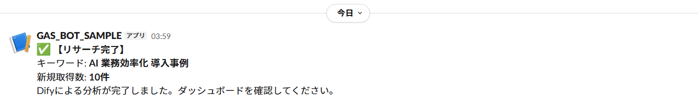
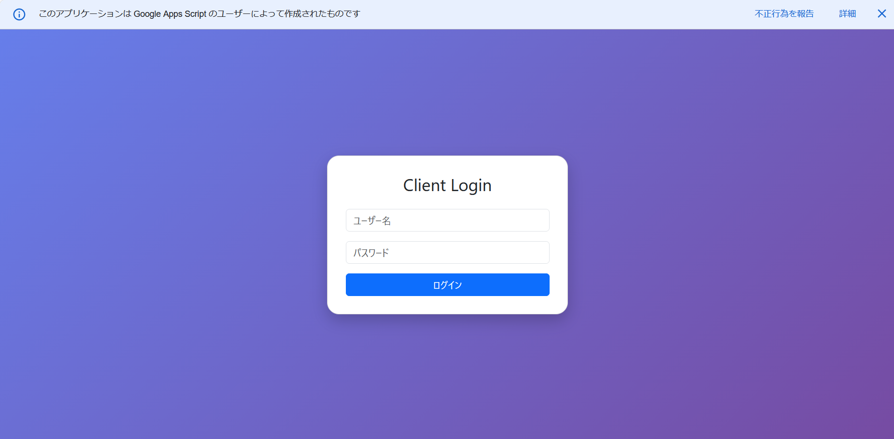
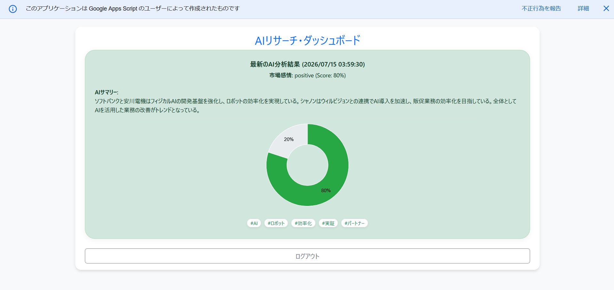
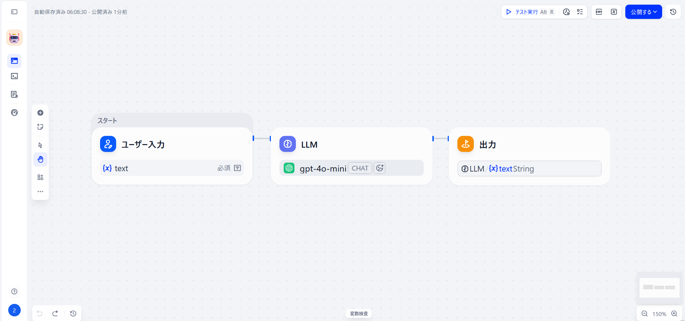
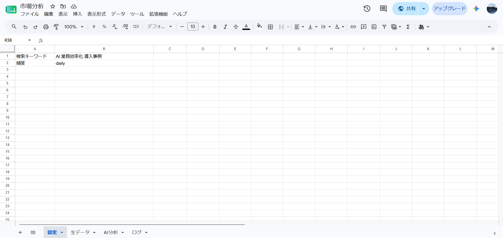
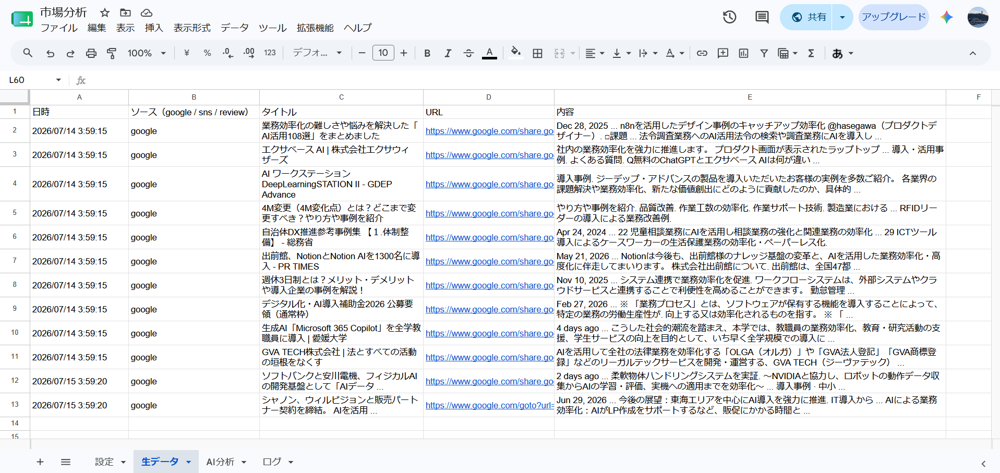
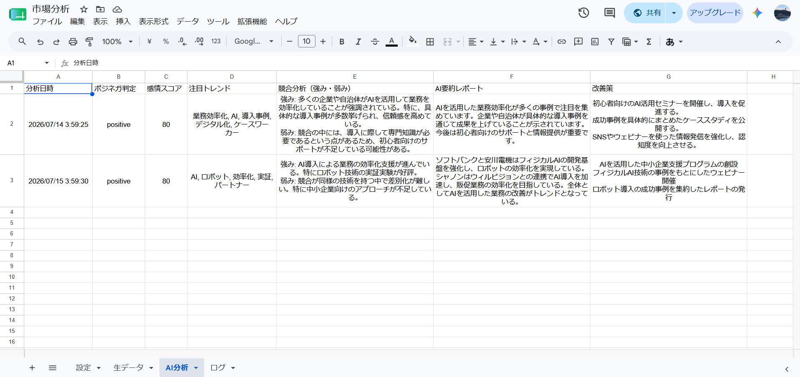
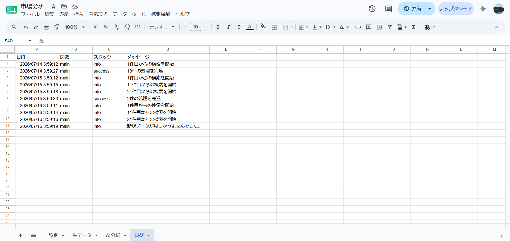

# Dify-App

## Dify-App: Auto Research & Analysis System
## Web情報収集・LLM分析・可視化を統合した自律型インテリジェンス・プラットフォーム

### 🔗 Live Demo (公開検証用)

#### https://script.google.com/macros/s/AKfycbwk7pm3Eb7vp0Hj29NweuC1AzqdjcZjCu01OnIs4nZ1gaUiOZexTrRyrVCyQ6G48SI/exec

### User ID: demo

### Password: demo

## 🛠 Current Status

#### https://docs.google.com/spreadsheets/d/1KqABS5Blonfm2scCW89rhnLx7ChabJR5iRGuiJ9tygA/edit?gid=1107744585#gid=1107744585

現在、本システム上で様々な検索ワードを設定し、動作検証と分析精度の確認をリアルタイムで進めています。実際の運用データに基づき、ロジックの微調整を継続的に行っている「生きたプロジェクト」です。

Google Apps Script (GAS) と Dify (LLM Workflow) を連携させ、特定トピックに関する最新情報の収集から、多角的なAI分析、そしてレポーティングまでを完全無人化した資産運用型リサーチシステムです。

ユーザーがキーワードを一度設定するだけで、

### ・深夜帯の自動Webリサーチ（StartIndexページング対応）

### ・URL重複排除によるコスト最適化

### ・Dify AIによる感情・トレンド・競合分析

### ・Slack通知とWebダッシュボードによる可視化

これらがすべて自律的に実行されます。「意思決定」にリソースを集中させたいビジネスパーソンに最適です。

---

## 🚀 開発コンセプト：プロダクトへの「品格」と「堅牢性」

「動けばいいツール」から「商売で使えるシステム」へ。
v1.0では「データの欠損」「重複によるコスト増」「海外サーバーの時差」といった細かなノイズを徹底排除し、翌朝には常に「正確で密度の高い分析レポート」が整列している状態を提供します。

---

## ✨ 主な機能と設計のこだわり

## 1. 検索深化ロジック（Deep Search Protocol）

startIndexによる自動ページめくり機能を実装。目標件数に達するまでリサーチを続行し、常にボリュームのある分析母数を確保します。

## 2. 可視化とSlack通知

深夜帯に完了した分析結果を、毎朝3時〜4時の間にSlackへ自動送信します。

単一のキーワードでは分析結果の方向性がブレるため、「AI 業務効率化 導入事例」のように2語以上の複合キーワードを推奨しています。これにより、ユーザーの意図に近いインサイトを抽出します。

以下の写真が、Slackでの通知のレイアウトとなっております。

## 3. Webダッシュボード（Visual Intelligence）

index.html により、以下の機能を備えた専用UIを提供します。

### ・認証画面：ブランド感のあるグラデーションUIを採用

### ・感情分析の可視化: Google Charts を用いたドーナツ型チャートにより、市場のポジティブ・ネガティブを直感的に把握

### ・ハッシュタグ: AIが抽出した trend_words を動的に生成し、キーワードの熱量を視覚化

### ログイン画面

### ダッシュボード画面

AIによって構造化された最新の分析レポートを表示します。

### 📊 実行ログとデータの整合性について

StartIndexによるページング処理が正確に実行され、目標件数に達するまでリサーチを深化させている様子が確認できます。

### 💡 日々リサーチを継続しているため、実行ログとダッシュボードの結果は常に最新の状態に更新されています。 常に「生きたデータ」を扱っているため、画像内の日付に差異がある場合がありますが、システムは正常に連携し稼働しています。

## 4. LLMモデルの柔軟な互換性管理

AIモデルの進化と仕様変更に即応するため、ワークフローのLLMモデルを定期的に見直す設計を採用。特定のモデルに依存せず、常にその時点での最適解（コスト・精度・速度）を追求できる構成としています。

### 5. コストと効率の最適化

重複排除: URLの照合により同一記事のAI投入を防ぎ、APIコストを最適化。

JST Timezone Lock: 日本標準時での固定出力により、報告資料としての整合性を維持。

---

## 🧭 システムワークフロー

本システムは「深夜自動実行」＋「常時可視化」の2段構成で動作します。

## 🛠️ Dify 自律型分析ワークフロー

単なるAPI連携ではなく、Dify上で複数のノードを組み合わせた独自の分析パイプラインを構築しています。

情報収集から構造化データの生成までを司るAIワークフロー図

## 🧠 AIアナリスト・プロンプトの設計

ワークフローの核となるLLMノードには、企業のマーケティング分析に特化した高度な命令セット（プロンプト）を実装しています。

## 設計のこだわりポイント：

### 「生の声」の優先抽出: 規約や料金表などの無機質なデータではなく、ユーザーの体験や口コミといった「市場の反応」を最優先で分析。

### ノイズ自動除外: 検索エラーや認証画面などの不要な情報をAIが自動判別し、分析対象から除外。

### ビジネス・アウトプット: 経営層の意思決定を支援するため、JSON形式での構造化と、プロフェッショナルな日本語トーンを徹底。

---

## 🔁 使用するトリガーと役割

### 関数名  タイミング	 役割

#### main  毎日 3:00 - 4:00  リサーチ・排除・AI分析・Slack通知の全工程を完遂

#### getLatestAnalysis  常時 (Webアクセス時)  Webダッシュボードへ最新の分析結果を配信

---

## 🛠 技術仕様 (Tech Stack)

#### Backend: Google Apps Script (GAS)

#### AI Orchestration: Dify Workflow API

#### Frontend: HTML5 / CSS3 (Bootstrap 5.3) / Google Charts

#### Security: ScriptProperties API / シンプルな認証プロトコル

---

## 📂 ファイル構成とシート役割

### ファイル / シート名	役割

#### main.gs	リサーチ・分析・通知を司るコアロジック

### 設定 シート	検索キーワードや実行頻度の管理

### 生データ シート	収集したWeb記事のバックアップ ＆ 重複チェック用DB

### AI分析 シート	Difyが生成した構造化データの蓄積

### ログ シート	実行状況およびエラー履歴の管理

### index.html	シンプルなUIを備えた、分析結果のWebダッシュボード

---

## 📈 今後の展望（Next Steps）

### 銘柄・キーワードの動的追加機能: ユーザーがダッシュボードから任意のキーワードを入力し、即座にリサーチを開始できるUIの構築。

### 長期的トレンド分析: 過去30日間のデータを遡及し、市場の変化を折れ線グラフで可視化する機能の拡張。

### グラフスケールの最適化: 急激なトレンド変化時にもグラフ表示が途切れないよう、自動スケール調整ロジックの導入。

---

## 🚀 セットアップ

### 本リポジトリの main.gs と index.html をGASエディタに配置。

### スクリプトプロパティに各種APIキーを設定。

### main 関数に時間主導型トリガー（深夜帯）を設定。

### 「デプロイ」>「ウェブアプリ」 として公開し、生成されたURLからダッシュボードにアクセス。

---
